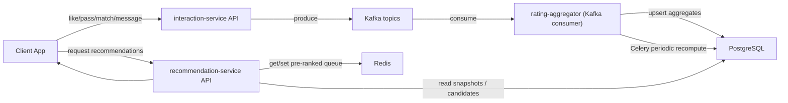

## Dating-приложение: система рейтинга анкет

Цель: спроектировать и задокументировать backend-часть dating-приложения, где порядок показа анкет определяется многоуровневой системой рейтинга:

- **Уровень 1 (первичный рейтинг)**: качество анкеты и соответствие предпочтениям пользователя.
- **Уровень 2 (поведенческий рейтинг)**: динамика на основе лайков/пропусков/матчей/инициации диалогов, с учетом активности по времени суток.
- **Уровень 3 (комбинированный рейтинг)**: взвешивание Level 1 и Level 2 + бонусы (рефералка).

Дополнительно:
- периодические пересчеты через **Celery**
- **Redis** для кэширования предварительно отранжированных списков/очередей
- потоковая обработка событий через **Kafka** (или аналогичную MQ) между сервисами
- метрики/логирование везде, где есть вычисления и интеграции
- хранение изображений в **S3-совместимом** хранилище (например, MinIO)

---

## 1) Сервисы

Архитектура:

1. **`profile-service`**
   - Анкеты кандидатов: возраст/пол/гео/интересы/качество заполнения.
   - Фото (связь с MinIO), статус/главная фотография.
   - Предпочтения viewer: возрастной диапазон, пол, город/радиус.

2. **`interaction-service`**
   - API для событий с фронта: `like`, `pass`, `match`, `message_initiated`.
   - Публикует события в **Kafka**.

3. **`rating-aggregator`**
   - Kafka consumer(ы), которые инкрементально обновляют агрегаты поведенческого уровня (Level 2) в PostgreSQL.
   - Celery workers/beat для регулярных пересчетов (снэпшоты Level 3).

4. **`recommendation-service`**
   - API “лента/подбор” для viewer.
   - Формирует ранжированный набор кандидатов из PostgreSQL и/или готового кэша в Redis.
   - Кэширует “очередь” на сессию и подгружает следующие анкеты заранее.
   
5. **`media-service`** (опционально как отдельный модуль)
   - Генерация URL/подписей для MinIO.
   - Логика загрузки/доступа к изображениям.

6. **Наблюдаемость**
   - единые контракты логов/метрик по сервисам
   - контроль lag consumer’ов Kafka, ошибок Redis/Postgres, времени формирования выдачи

---

## 2) Потоки данных (end-to-end)

Ключевая идея:
- Level 2 считается **по кандидату** на основе всех взаимодействий.
- Level 1 и Level 3 считаются **в контексте viewer -> candidate** (потому что первичный рейтинг зависит от предпочтений viewer).
- В ленту отдается уже **Level 3 snapshot**, чтобы быстро ранжировать без тяжелых вычислений на запросе.

---

## 3) Модель рейтинга

### 3.1 Уровень 1: первичный рейтинг

Компоненты:
1. **Возраст/пол**: соответствие возрастному диапазону и полу предпочтений viewer.
2. **Гео**: совпадение города или близость (радиус/дистанция) между viewer и candidate.
3. **Интересы**: пересечение interest’ов и/или сходство (например, Jaccard или weighted overlap).
4. **Качество анкеты**:
   - полнота заполнения (например, доля заполненных полей или отдельный `bio_quality`)
   - количество/статус фото (например, наличие `main_photo` и число `active photos`)
5. **Доп. первичные фильтры**: быстрые исключения по базовым несовпадениям (например, если совсем не проходит возраст/пол).

Результат: `primary_score(viewer_id, candidate_id)` в диапазоне [0..1] или в заранее заданной шкале.

### 3.2 Уровень 2: поведенческий рейтинг

Идея: поведенческий рейтинг характеризует “как часто кандидат выигрывает” с точки зрения общей аудитории.

Метрики на кандидате:
1. `likes_count`
2. `passes_count`
3. `mutual_match_count` (частота взаимных лайков/матчей)
4. `message_initiated_count` (сколько раз после матча диалог был инициирован)
5. (опционально на ранней итерации) разбиение по **тайм-слотам** активности:
   - morning/day/evening/night или 4/6/8 слотов
   - учет “когда” вели себя пользователи (по event `ts`).

Нормализация:
- превращаем “сырые счетчики” в вероятности/индексы:
  - например, `like_rate = likes / (likes + passes)`
  - `match_rate = matches / likes` (или / (likes + passes), зависит от вашей трактовки)
  - `message_rate = messages_initiated / matches`
- итог: `behavioral_score(candidate_id, [time_slot])`

### 3.3 Уровень 3: комбинированный рейтинг

Интеграция:
- `combined_score = w_primary * primary_score + w_behavioral * behavioral_score + w_referral * referral_bonus`

Реферальный бонус:
- `referral_bonus` можно задавать как фиксированную прибавку (например, кандидат/его приглашение дает бонус inviter’у)
- или как коэффициент на основании количества/свежести приглашений (это уже “расширение”, но в схеме стоит место).

Версионирование весов:
- хранить `score_version`, чтобы при изменении весов не “ломать” уже сформированные снэпшоты.

---

## 4) Kafka: какие события нужны

Топики (пример именования):
- `interaction.like`
- `interaction.pass`
- `interaction.match`
- `interaction.message_initiated`

Минимальный payload (концептуально):
- `viewer_id`
- `candidate_id`
- `ts` (timestamp события, обязателен для time-of-day)
- `metadata` (опционально: device, app_version, locale и т.п.)

Почему Kafka:
- разгружает API сервис от пересчетов
- позволяет “догонять” вычисления consumers’ами
- даёт основу для потоковой обработки общения сервисов/диалогов в будущем.

---

## 5) PostgreSQL: схема данных

### 5.1 Профиль и настройки

1. `users`
   - `id (pk)`
   - другие служебные поля

2. `user_profiles`
   - `user_id (pk/fk)`
   - `birth_date` или `age`
   - `gender`
   - `city_id` или `geo_lat/geo_lon`
   - `bio_quality` (числовой proxy заполненности)
   - `created_at`, `updated_at`

3. `user_interests`
   - составная PK: (`user_id`, `interest_id`)

4. `user_photos`
   - `id (pk)`
   - `user_id (fk)`
   - `s3_object_key`
   - `is_main`
   - `status` (например: `active`, `deleted`)
   - `created_at`

5. `user_preferences` (предпочтения viewer)
   - `viewer_id (pk/fk)`
   - `preferred_age_min`, `preferred_age_max`
   - `preferred_genders` (массив или отдельная таблица)
   - `preferred_city_id` или `max_distance_km`

### 5.2 Рефералы

6. `referrals`
   - `inviter_id (fk)`
   - `referred_id (fk)`
   - `created_at`
   - PK: (`inviter_id`, `referred_id`)

### 5.3 Агрегаты поведенческого уровня (Level 2)

7. `candidate_behavioral_stats`
   - `candidate_id (pk/часть pk)`
   - (опционально) `time_slot`
   - (опционально) `window_start` (если хотите считать “по окну”)
   - `likes_count`
   - `passes_count`
   - `mutual_match_count`
   - `message_initiated_count`
   - индексы по candidate_id и (window_start/time_slot)

Опционально (для восстановления/аудита):
- `interaction_events` (append-only в Postgres) можно хранить после consume Kafka, чтобы пересчитывать статистику даже при проблемах consumer’а.

### 5.4 Версии весов и снэпшоты ранжирования (Level 3)

8. `ranking_score_versions`
   - `id (pk)`
   - `w_primary`, `w_behavioral`, `w_referral`
   - `created_at`

9. `user_candidate_ratings_snapshot`
   - `viewer_id`
   - `candidate_id`
   - `primary_score`
   - `behavioral_score`
   - `referral_bonus`
   - `combined_score`
   - `score_version`
   - `computed_at`

Идея: recommendation-service читает snapshot и быстро формирует выдачу.

---

## 6) Celery: пересчет рейтингов

### 6.1 Инкрементальные обновления (почти real-time)

Kafka consumer обновляет:
- `candidate_behavioral_stats` (инкрементально)

Далее можно:
- либо “мягко” дергать пересчет с задержкой
- либо ждать периодических пересчетов (в зависимости от нагрузки).

### 6.2 Периодические пересчеты (regular recompute)

Celery beat/cron:
1. `recompute_behavioral_score`
   - преобразует агрегаты `candidate_behavioral_stats` в шкалированные `behavioral_score`
2. `recompute_primary_score` (можно батчами)
   - для viewer-candidate пар, которые реально будут показаны
   - или для кандидатов в “кандидатном пуле”
3. `recompute_combined_snapshot`
   - объединяет Level 1 + Level 2 + referral_bonus
   - записывает в `user_candidate_ratings_snapshot`

Практический подход:
- сначала сделать проще: батч “пули кандидатов на каждый viewer” периодически обновляется.

---

## 7) Redis: кэширование очередей на сессию

Задача: чтобы при старте сессии viewer не ждал вычислений на каждом клике.

Стратегия из вашего описания:
- “первая анкета” проходит полный путь через сервисы
- параллельно подгружаем еще `N=10` анкет в Redis
- выдаем их viewer по очереди
- после выдачи последней из 10 — повторяем круг.

Ключи (пример):
- `reco:queue:{viewer_id}:{session_id}` -> `LIST` (или `ZSET`, если удобнее пересортировать)
- `reco:prefetch:{viewer_id}:{session_id}` -> промежуточный список
- TTL на сессию (например, 10-60 минут, зависит от продуктовой логики)

Политика обновления:
- если в Redis очередь закончилась или протухла — инициируем пополнение из PostgreSQL.

---

## 8) Хранение изображений (MinIO/S3)

Поток:
- загрузка фото в MinIO (через `media-service` или прямым методом)
- сохранение `s3_object_key` в `user_photos`
- scoring анкеты учитывает:
  - наличие главного фото (`is_main`)
  - количество активных фотографий
  - (опционально) “качество” фото через метаданные (если появится)

---

## 9) Метрики и логирование

Точки метрик:
- ingestion событий (Kafka produce/consume latency, количество ошибок)
- lag consumer’ов Kafka (чтобы понимать, отстаем ли мы)
- время пересчета:
  - пересчет behavioral
  - пересчет combined snapshot
- время формирования выдачи (recommendation-service)
- попадания/промахи Redis кэша (hit rate)
- доля кандидатов, которые отфильтровали по базовым условиям (age/gender/geo)

Логирование:
- структурированные логи (viewer_id/candidate_id/score_version)
- корреляция request_id между API и background работами.