# Отчёт: Аномалии изоляции в SQL

**СУБД:** PostgreSQL 16  
**Уровень изоляции по умолчанию:** READ COMMITTED  

---

## Выбранные аномалии

Для демонстрации выбраны все четыре аномалии изоляции:

1. **Dirty Read** — грязное чтение
2. **Non-Repeatable Read** — неповторяемое чтение
3. **Phantom Read** — фантомное чтение
4. **Lost Update** — потерянное обновление

---

## Структура тестовых данных

Создано три таблицы (скрипт `00_setup.sql`):


-- Для аномалий 1 и 2: трансферные бюджеты клубов

-- Для аномалии 3: заказы из магазина клубной атрибутики

-- Для аномалии 4: статистика матчей

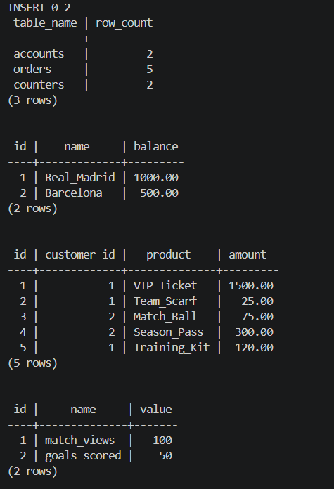

---

## Аномалия 1: Dirty Read (Грязное чтение)

### Описание

Транзакция T1 читает данные, изменённые транзакцией T2, которая ещё не выполнила COMMIT. Если T2 откатится, T1 работала с несуществующими данными.

### Уровень изоляции

Возникает при: **READ UNCOMMITTED**

### Шаги воспроизведения

| Время | Сессия 1 (T1)                                              | Сессия 2 (T2)                                    |
|-------|------------------------------------------------------------|--------------------------------------------------|
| t1    | `BEGIN;`                                                   |                                                  |
| t2    | `SET TRANSACTION ISOLATION LEVEL READ UNCOMMITTED;`        |                                                  |
| t3    | `SELECT balance FROM accounts WHERE name='Real_Madrid';`   |                                                  |
| t4    |                                                            | `BEGIN;`                                         |
| t5    |                                                            | `UPDATE accounts SET balance=9999 WHERE name='Real_Madrid';` |
| t6    | `SELECT balance FROM accounts WHERE name='Real_Madrid';`   |                                                  |
| t7    |                                                            | `ROLLBACK;`                                      |
| t8    | `SELECT balance FROM accounts WHERE name='Real_Madrid';`   |                                                  |
| t9    | `COMMIT;`                                                  |                                                  |

### Полученный результат

```
-- Шаг t3: Сессия 1 читает начальный бюджет
```
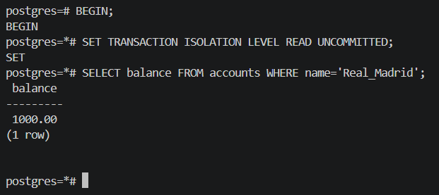

```
-- Шаг t6: Сессия 1 читает данные после UPDATE (T2 не сделала COMMIT)
```
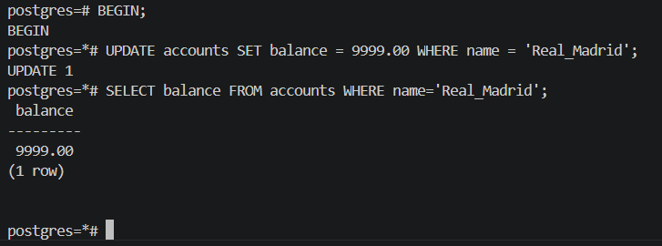
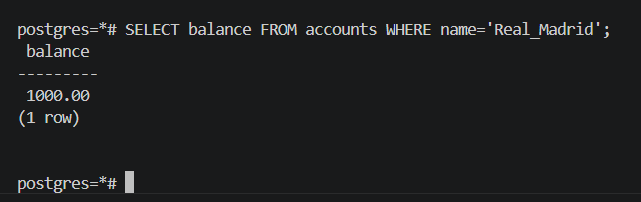

```
-- В системе с настоящим READ UNCOMMITTED (например, MySQL):
-- Шаг t6 показал бы: 9999.00  ← АНОМАЛИЯ (грязное чтение!)
-- Шаг t8 показал бы: 1000.00  ← T2 откатилась, T1 работала с ложными данными
```

```
-- Шаг t8: После ROLLBACK T2
    name     | balance
-------------+---------
 Real_Madrid | 1000.00   ← Данные корректны
```

### Как избежать

- PostgreSQL предотвращает dirty read **автоматически** — даже уровень READ UNCOMMITTED работает как READ COMMITTED
- В других СУБД (MySQL, MSSQL): использовать уровень **READ COMMITTED** или выше
- Минимальный безопасный уровень: **READ COMMITTED**

---

## Аномалия 2: Non-Repeatable Read (Неповторяемое чтение)

### Описание

Транзакция T1 дважды читает одну и ту же строку и получает разные результаты, потому что между двумя чтениями T2 изменила эту строку и зафиксировала изменение.

### Уровень изоляции

Возникает при: **READ COMMITTED** (уровень по умолчанию в PostgreSQL)

### Шаги воспроизведения

| Время | Сессия 1 (T1)                                              | Сессия 2 (T2)                                         |
|-------|------------------------------------------------------------|-------------------------------------------------------|
| t1    | `BEGIN;`                                                   |                                                       |
| t2    | `SET TRANSACTION ISOLATION LEVEL READ COMMITTED;`          |                                                       |
| t3    | `SELECT balance FROM accounts WHERE name='Real_Madrid';`   |                                                       |
|       | → Результат: **1000.00**                                   |                                                       |
| t4    |                                                            | `BEGIN;`                                              |
| t5    |                                                            | `UPDATE accounts SET balance=2000 WHERE name='Real_Madrid';` |
| t6    |                                                            | `COMMIT;`                                             |
| t7    | `SELECT balance FROM accounts WHERE name='Real_Madrid';`   |                                                       |
|       | → Результат: **2000.00** ← АНОМАЛИЯ                       |                                                       |
| t8    | `COMMIT;`                                                  |                                                       |

### Полученный результат

```
-- Шаг t3: Первое чтение в Сессии 1
```
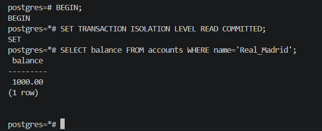

```
-- Шаг t7: Второе чтение той же строки в той же транзакции
```
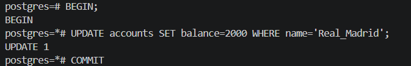
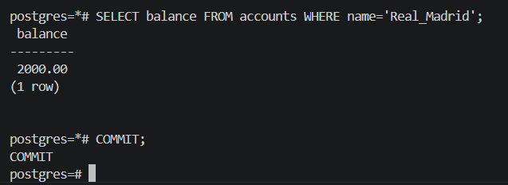


### Как избежать

Использовать уровень изоляции **REPEATABLE READ**:

```sql
BEGIN;
SET TRANSACTION ISOLATION LEVEL REPEATABLE READ;
-- Теперь оба SELECT вернут 1000.00, даже если T2 уже сделала COMMIT
```

PostgreSQL использует MVCC (Multi-Version Concurrency Control) — каждая транзакция видит снимок данных на момент своего начала.

---

## Аномалия 3: Phantom Read (Фантомное чтение)

### Описание

Транзакция T1 дважды выполняет один и тот же запрос с условием фильтрации и получает разные наборы строк — потому что T2 добавила новые строки, удовлетворяющие условию. Новые строки называются «фантомами».

**Отличие от Non-Repeatable Read:** при NRR изменяется значение в существующей строке; при Phantom Read изменяется количество строк в выборке.

### Уровень изоляции

Возникает при: **READ COMMITTED**

### Шаги воспроизведения

| Время | Сессия 1 (T1)                                              | Сессия 2 (T2)                                              |
|-------|------------------------------------------------------------|------------------------------------------------------------|
| t1    | `BEGIN;`                                                   |                                                            |
| t2    | `SET TRANSACTION ISOLATION LEVEL READ COMMITTED;`          |                                                            |
| t3    | `SELECT COUNT(*) FROM orders WHERE amount > 100;`          |                                                            |
|       | → Результат: **3**                                         |                                                            |
| t4    |                                                            | `BEGIN;`                                                   |
| t5    |                                                            | `INSERT INTO orders (customer_id, product, amount) VALUES (3, 'VIP_Box', 450);` |
| t6    |                                                            | `COMMIT;`                                                  |
| t7    | `SELECT COUNT(*) FROM orders WHERE amount > 100;`          |                                                            |
|       | → Результат: **4** ← АНОМАЛИЯ (фантом!)                   |                                                            |
| t8    | `COMMIT;`                                                  |                                                            |

### Полученный результат

```
-- Шаг t3: Первый подсчёт в Сессии 1
```
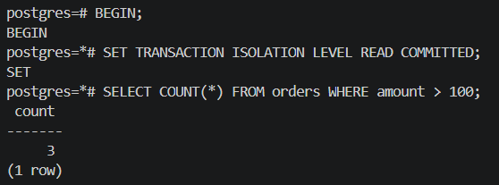
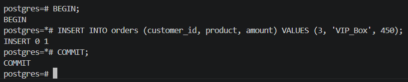

```
-- Шаг t7: Повторный подсчёт с тем же условием
```
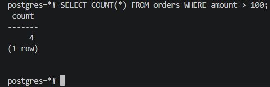

```
-- Детальный список на шаге t7:
 id |   product    | amount
----+--------------+---------
  1 | VIP_Ticket   | 1500.00
  4 | Season_Pass  |  300.00
  5 | Training_Kit |  120.00
  6 | VIP_Box      |  450.00  ← фантомная строка
```

### Как избежать

**Вариант 1 — SERIALIZABLE:**
```sql
SET TRANSACTION ISOLATION LEVEL SERIALIZABLE;
-- PostgreSQL отследит зависимость чтения и при конфликте выбросит:
-- ERROR: could not serialize access due to read/write dependencies
-- Приложение должно повторить транзакцию.
```

**Вариант 2 — REPEATABLE READ (специфика PostgreSQL):**
```sql
SET TRANSACTION ISOLATION LEVEL REPEATABLE READ;
-- В PostgreSQL MVCC также предотвращает phantom read на этом уровне.
-- Оба COUNT(*) вернут 3.
```

---

## Аномалия 4: Lost Update (Потерянное обновление)

### Описание

Две транзакции T1 и T2 одновременно читают одно значение, вычисляют новое и записывают. T2 фиксирует изменение, затем T1 перезаписывает его на основе старого значения — обновление T2 теряется.

**Пример:** счётчик просмотров матча. Начальное значение: 100. Оба пользователя хотят увеличить на 1. Ожидается 102, получается 101.

### Уровень изоляции

Возникает при: **READ COMMITTED**

### Шаги воспроизведения

| Время | Сессия 1 (T1)                                                    | Сессия 2 (T2)                                         |
|-------|------------------------------------------------------------------|-------------------------------------------------------|
| t1    | `BEGIN;`                                                         |                                                       |
| t2    | `SELECT value FROM counters WHERE name='match_views';`           |                                                       |
|       | → Результат: **100**                                             |                                                       |
| t3    |                                                                  | `BEGIN;`                                              |
| t4    |                                                                  | `SELECT value FROM counters WHERE name='match_views';`|
|       |                                                                  | → Результат: **100**                                  |
| t5    |                                                                  | `UPDATE counters SET value=101 WHERE name='match_views';` |
| t6    |                                                                  | `COMMIT;`                                             |
| t7    | `UPDATE counters SET value=101 WHERE name='match_views';`        |                                                       |
| t8    | `COMMIT;`                                                        |                                                       |
| t9    | `SELECT value FROM counters WHERE name='match_views';`           |                                                       |
|       | → Результат: **101** ← АНОМАЛИЯ (ожидалось 102)                 |                                                       |

### Полученный результат

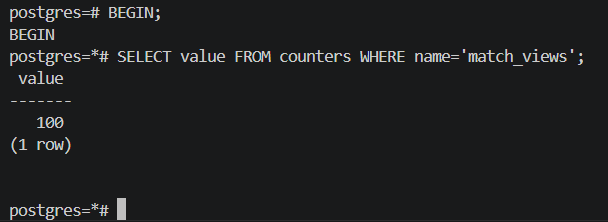

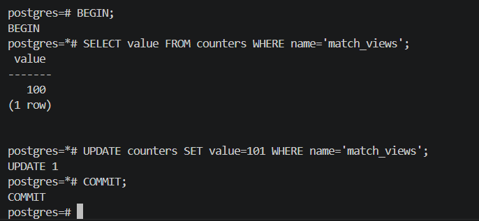

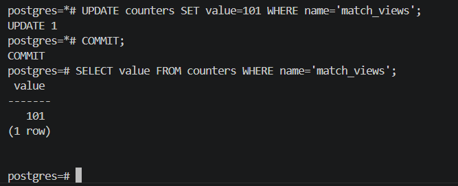

### Как избежать

**Способ 1 — Атомарный UPDATE (рекомендуется):**
```sql
UPDATE counters SET value = value + 1 WHERE name = 'match_views';
-- Операция выполняется атомарно, без состояния гонки.
```

**Способ 2 — SELECT FOR UPDATE (пессимистичная блокировка):**
```sql
BEGIN;
SELECT value FROM counters WHERE name='match_views' FOR UPDATE;
-- Строка заблокирована — T2 будет ждать завершения T1
UPDATE counters SET value = 101 WHERE name='match_views';
COMMIT;
```

**Способ 3 — REPEATABLE READ:**
```sql
BEGIN;
SET TRANSACTION ISOLATION LEVEL REPEATABLE READ;
-- PostgreSQL обнаружит конфликт и выбросит ошибку сериализации
-- Приложение повторяет транзакцию
```

---

## Сводная таблица: уровни изоляции и аномалии

| Уровень изоляции        | Dirty Read     | Non-Repeatable Read | Phantom Read     | Lost Update |
|-------------------------|:--------------:|:-------------------:|:----------------:|:-----------:|
| READ UNCOMMITTED        | Возможна     | Возможна            | Возможна         | Возможен    |
| READ COMMITTED (умолч.) | Нет            | **Возможна**        | **Возможна**     | **Возможен**|
| REPEATABLE READ         | Нет            | Нет                 | Нет (в PG)  | Нет         |
| SERIALIZABLE            | Нет            | Нет                 | Нет              | Нет         |


---

## Заключение

В ходе практики воспроизведены четыре аномалии изоляции транзакций. Установлено:

- **Dirty Read** в PostgreSQL предотвращается автоматически благодаря реализации MVCC
- **Non-Repeatable Read** возникает при уровне READ COMMITTED; устраняется повышением до REPEATABLE READ
- **Phantom Read** возникает при уровне READ COMMITTED; устраняется уровнем SERIALIZABLE или REPEATABLE READ (в PostgreSQL)
- **Lost Update** возникает при конкурентных операциях чтение-изменение-запись; устраняется атомарным UPDATE или SELECT FOR UPDATE

Повышение уровня изоляции устраняет аномалии, но снижает параллельность и производительность. На практике выбирают минимально необходимый уровень изоляции для конкретной бизнес-логики.
